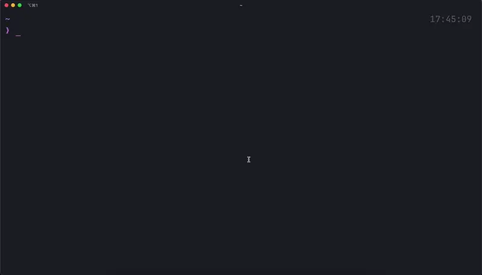

# kstrk

kstrk (Keystroke) is a command-line tool for practicing typing and testing your typing speed. Inspired heavily by [monkeytype](https://monkeytype.com), it brings a similar experience to your terminal.

This project was created primarily for fun and to explore the possibilities of using ANSI escape codes in the terminal.



## 📦 Installation

Install using npm:

```bash
npm i -g @kchips/kstrk
```

## ❓ Usage

You can use the following flags:

- `-t, --time <time>` Set the time limit in seconds
- `-i, --infinite` Play in infinite mode, without a time limit
- `--download-words` Download the default words file
- `--config` Shows the path of the config file
- `-h, --help` Shows the help menu
- `-V, --version` Shows the version

## ⚙️ Configuration

You can get the config file, using the `kstrk --config` command.

## 📝 License

This project is licensed under the MIT License - see the [LICENSE](./LICENSE) file for details.
